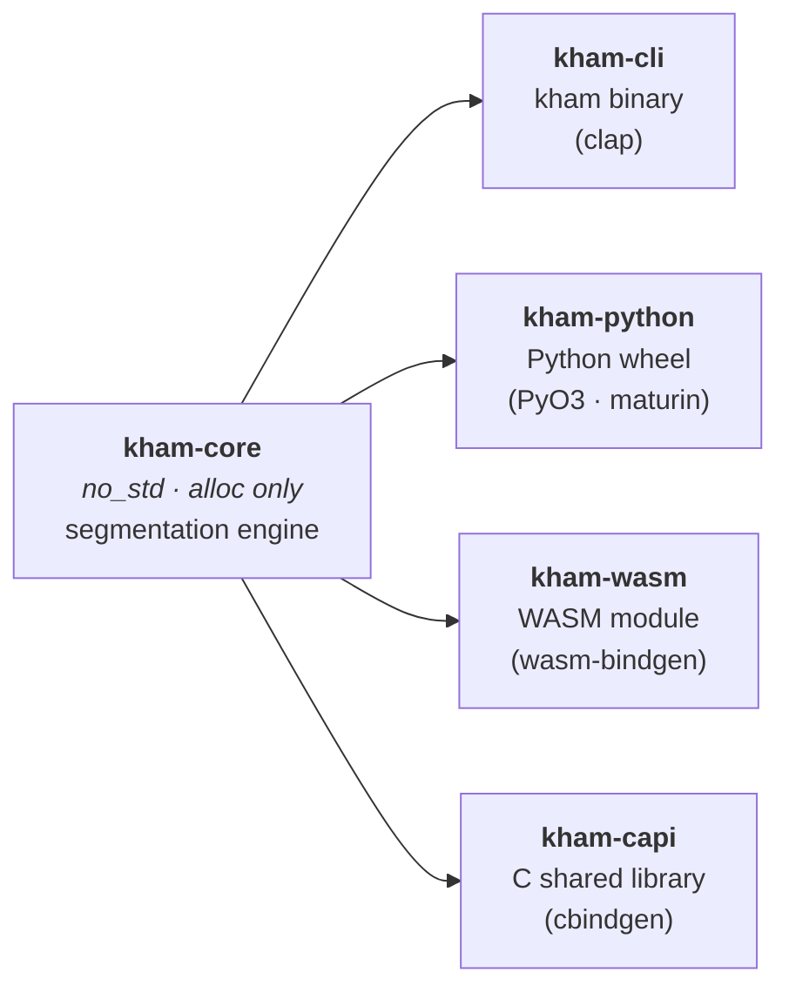
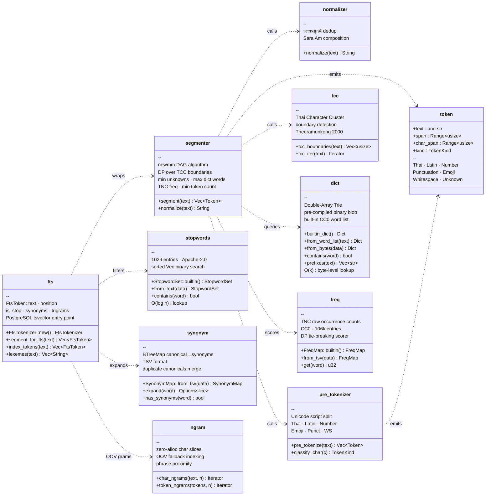

# kham

Thai word segmentation engine written in Rust. Fast, `no_std`-compatible core library with bindings for Python, WebAssembly, C, and a command-line interface.

[](https://github.com/preedep/kham/actions/workflows/ci.yml)
[](https://crates.io/crates/kham-core)
[](https://pypi.org/project/kham/)
[](https://www.npmjs.com/package/kham-wasm)

## Features

- **newmm algorithm** — DAG-based maximal matching constrained to Thai Character Cluster (TCC) boundaries
- **Multi-target** — single core library ships as a Rust crate, Python wheel, WASM module, C shared library, and CLI binary
- **Zero-copy API** — `segment()` returns `&str` slices into the original input; no heap allocation per token
- **`no_std` core** — `kham-core` compiles for bare-metal targets (`alloc` only, no `std` dependency)
- **Built-in dictionary** — 62,102-word CC0-licensed Thai word list embedded at compile time; custom dictionaries loaded at runtime
- **TNC frequency scoring** — Thai National Corpus (CC0) raw counts guide the DP scorer to prefer statistically common segmentations when multiple dictionary paths tie
- **Pre-compiled DARTS** — Double-Array Trie is built once at compile time (`build.rs`) and loaded from a binary blob at runtime (~64 µs vs ~960 ms construction from text)
- **Text normalization** — วรรณยุกต์ dedup and Sara Am composition before segmentation
- **Thai FTS pipeline** — `FtsTokenizer` adds stopword filtering (1 029 built-in entries, PyThaiNLP Apache-2.0), synonym expansion (TSV-driven `SynonymMap`), and character n-gram fallback for OOV tokens; ready for PostgreSQL `tsvector` integration
- **Structured CLI logging** — `RUST_LOG`-controlled output with coloured log levels via `env_logger` + `colored`

## Packages

| Crate | Registry | Description |
|---|---|---|
| `kham-core` | [crates.io](https://crates.io/crates/kham-core) | Pure Rust engine, `no_std` compatible |
| `kham-cli` | [crates.io](https://crates.io/crates/kham-cli) | `kham` binary (clap) |
| `kham-python` | [PyPI](https://pypi.org/project/kham/) | Python bindings via PyO3 / maturin |
| `kham-wasm` | [npm](https://www.npmjs.com/package/kham-wasm) | WebAssembly bindings via wasm-bindgen |
| `kham-capi` | [crates.io](https://crates.io/crates/kham-capi) | C FFI with cbindgen-generated header |

## Quick start

### Rust

```toml
[dependencies]
kham-core = "0.1"
```

```rust
use kham_core::Tokenizer;

let tok = Tokenizer::new();
let tokens = tok.segment("กินข้าวกับปลา");
for t in &tokens {
    println!("{} ({:?})", t.text, t.kind);
}
// กิน (Thai)
// ข้าว (Thai)
// ...
```

Mixed script works out of the box:

```rust
let tokens = tok.segment("ธนาคาร100แห่ง");
assert_eq!(tokens[0].text, "ธนาคาร"); // Thai
assert_eq!(tokens[1].text, "100");     // Number
assert_eq!(tokens[2].text, "แห่ง");   // Thai
```

For input that may contain stacked tone marks or decomposed Sara Am, normalize first:

```rust
let normalized = tok.normalize(raw_input); // tone dedup + Sara Am composition
let tokens = tok.segment(&normalized);     // tokens borrow `normalized`
```

### Python

```bash
pip install kham
```

```python
import kham

# Simple — list of token strings
tokens = kham.segment("กินข้าวกับปลา")
print(tokens)  # ['กิน', 'ข้าว', 'กับ', 'ปลา']

# Rich — Token objects with span information
tokens = kham.segment_tokens("ธนาคาร100แห่ง")
for t in tokens:
    print(t.text, t.char_start, t.char_end, t.kind)
# ธนาคาร  0  6  Thai
# 100     6  9  Number
# แห่ง    9  13 Thai
```

`Token` attributes: `text`, `byte_start`, `byte_end`, `char_start`, `char_end`, `kind`.

### JavaScript / TypeScript (WASM)

```bash
npm install kham-wasm
```

```js
import init, { segment, segment_tokens } from "kham-wasm";
await init();

// Simple — array of token strings
const words = segment("กินข้าวกับปลา");
console.log(words); // ["กิน", "ข้าว", "กับ", "ปลา"]

// Rich — Token objects with span information
const tokens = segment_tokens("ธนาคาร100แห่ง");
for (const t of tokens) {
    console.log(t.text, t.char_start, t.char_end, t.kind);
}
// ธนาคาร  0  6  Thai
// 100     6  9  Number
// แห่ง    9  13 Thai
```

`Token` properties: `text`, `byte_start`, `byte_end`, `char_start`, `char_end`, `kind`.

> **Note on JS string offsets:** `char_start`/`char_end` are Unicode scalar-value counts.
> For BMP text these equal JavaScript's `string.slice()` indices. For surrogate-pair
> emoji, use `byte_start`/`byte_end` with `TextEncoder` for precise byte-level slicing.

### CLI

```bash
cargo install kham-cli
```

```bash
# Positional argument
kham "กินข้าวกับปลา"
# กิน|ข้าว|กับ|ปลา

# Custom separator
kham --sep " / " "สวัสดีชาวโลก"
# สวัสดี / ชาว / โลก

# Show token kinds
kham --kind "ธนาคาร100แห่ง"
# ธนาคาร:Thai|100:Number|แห่ง:Thai

# Show Unicode char spans
kham --spans "กินข้าวกับปลา"
# กิน:0-3|ข้าว:3-7|กับ:7-10|ปลา:10-13

# Combine kind and spans
kham --kind --spans "กินข้าว"
# กิน:Thai:0-3|ข้าว:Thai:3-7

# Normalize before segmenting
kham --normalize "กิน\u{0E02}\u{0E49}\u{0E49}าว"

# Custom dictionary
kham --dict my_words.txt "มะม่วงหิมพานต์"

# Pipeline / stdin
echo "กินข้าว" | kham
cat corpus.txt | kham --sep " "
```

Full options:

```
Usage: kham [OPTIONS] [TEXT]

Arguments:
  [TEXT]  Thai text to segment. Reads from stdin line-by-line if omitted.

Options:
  -d, --dict <FILE>   Path to a custom word-list file (newline-separated)
  -s, --sep <SEP>     Output separator between tokens [default: |]
  -w, --whitespace    Include whitespace tokens in output
  -n, --normalize     Run normalize() before segmenting
  -k, --kind          Append token kind after each token (e.g. กิน:Thai)
      --spans         Append Unicode char span after each token (e.g. กิน:0-3)
  -h, --help          Print help
  -V, --version       Print version
```

Debug and timing output is controlled by the `RUST_LOG` environment variable:

```bash
RUST_LOG=debug kham "กินข้าวกับปลา"   # full per-token trace + timing
RUST_LOG=info  kham --dict w.txt "..."  # dict-load confirmation only
```

### C

Generate the header and link `libkham_capi`:

```bash
cbindgen --config kham-capi/cbindgen.toml --crate kham-capi --output kham-capi/include/kham.h
cargo build -p kham-capi --release
```

```c
#include "kham.h"

// Simple — array of token strings
KhamTokens *tokens = kham_segment("กินข้าวกับปลา");
for (size_t i = 0; i < tokens->len; i++) {
    printf("%s\n", tokens->words[i]);
}
kham_tokens_free(tokens);

// Rich — KhamToken structs with full span information
KhamTokenList *list = kham_segment_tokens("ธนาคาร100แห่ง");
for (size_t i = 0; i < list->len; i++) {
    KhamToken t = list->tokens[i];
    printf("%s  char %zu..%zu  %s\n", t.text, t.char_start, t.char_end, t.kind);
}
// ธนาคาร  char 0..6   Thai
// 100     char 6..9   Number
// แห่ง    char 9..13  Thai
kham_token_list_free(list);
```

`KhamToken` fields: `text`, `byte_start`, `byte_end`, `char_start`, `char_end`, `kind` (all null-terminated UTF-8 strings or `size_t`).

## Token contract

Every `segment()` call returns `Vec<Token>`:

```rust
pub struct Token<'a> {
    pub text: &'a str,            // zero-copy slice of the input string
    pub span: Range<usize>,       // byte offsets in the original string
    pub char_span: Range<usize>,  // Unicode scalar-value (char) offsets
    pub kind: TokenKind,          // Thai | Latin | Number | Punctuation | Emoji | Whitespace | Unknown
}
```

- `span` — byte offsets; use to slice `&str` directly (`&input[token.span.clone()]`)
- `char_span` — Unicode scalar-value offsets; use for Python/JavaScript string indexing where strings are char- or code-unit-indexed
- Both spans are always valid UTF-8 boundaries
- Joining all `token.text` values (with whitespace kept) reconstructs the original input exactly

```rust
use kham_core::Tokenizer;

let tok = Tokenizer::new();
let input = "ธนาคาร100แห่ง";
let tokens = tok.segment(input);

// ธนาคาร: 6 chars, 18 bytes
assert_eq!(tokens[0].span,      0..18);
assert_eq!(tokens[0].char_span, 0..6);

// 100: 3 chars, 3 bytes
assert_eq!(tokens[1].span,      18..21);
assert_eq!(tokens[1].char_span, 6..9);
```

## Custom dictionary

```rust
// From a string
let tok = Tokenizer::builder()
    .dict_words("มะม่วงหิมพานต์\nกระทะ\n")
    .build();

// From a file (requires the `std` feature)
let tok = Tokenizer::builder()
    .dict_file("my_words.txt")?
    .build();

// Keep whitespace tokens
let tok = Tokenizer::builder()
    .keep_whitespace(true)
    .build();
```

## Full-Text Search (FTS)

`kham-core` ships a complete Thai FTS pipeline on top of the segmenter, ready for PostgreSQL `tsvector` integration (see `kham-pg`, Phase 2).

### Basic indexing

```rust
use kham_core::fts::FtsTokenizer;

let fts = FtsTokenizer::new(); // built-in stopwords, no synonyms

// All tokens with metadata
let tokens = fts.segment_for_fts("กินข้าวกับปลา");
for t in &tokens {
    println!("{} pos={} stop={}", t.text, t.position, t.is_stop);
}
// กิน  pos=0 stop=false
// ข้าว pos=1 stop=false
// กับ  pos=2 stop=true   ← conjunction → filtered at index time
// ปลา  pos=3 stop=false

// Flat lexeme list for tsvector (stopwords removed)
let lexemes = fts.lexemes("กินข้าวกับปลา");
// → ["กิน", "ข้าว", "ปลา"]
```

### Synonym expansion

Define a TSV file where each line maps a canonical form to one or more equivalents:

```text
คอม    คอมพิวเตอร์    computer
รถไฟฟ้า    BTS    MRT    รถไฟใต้ดิน
```

```rust
use kham_core::fts::FtsTokenizer;
use kham_core::synonym::SynonymMap;

let synonyms = SynonymMap::from_tsv(include_str!("synonyms.tsv"));
let fts = FtsTokenizer::builder().synonyms(synonyms).build();

let lexemes = fts.lexemes("ซื้อคอมใหม่");
// → ["ซื้อ", "คอม", "คอมพิวเตอร์", "computer", "ใหม่"]
//              ^^^^^^^^^^^^^^^^^^^^^^^^^^^^^^^^^^^  expanded
```

### Custom stopwords

```rust
use kham_core::stopwords::StopwordSet;
use kham_core::fts::FtsTokenizer;

// Add domain-specific stopwords on top of the built-in list
let extra = StopwordSet::from_text("ซื้อ\nขาย\nราคา\n");
let fts = FtsTokenizer::builder().stopwords(extra).build();
```

### OOV (out-of-vocabulary) n-grams

Words not in the dictionary are emitted as `TokenKind::Unknown`. The FTS pipeline automatically generates character n-grams for these tokens so they remain searchable:

```rust
// Default ngram_size = 3 (trigrams)
// Unknown token "สกรีน" (3-char TCC clusters) → ["สกร", "กรี", "รีน"]

// Disable n-gram generation:
let fts = FtsTokenizer::builder().ngram_size(0).build();
```

### `FtsToken` fields

| Field | Type | Description |
|---|---|---|
| `text` | `String` | Token text (normalised) |
| `position` | `usize` | Ordinal index in non-whitespace sequence (0-based) |
| `kind` | `TokenKind` | Thai / Latin / Number / … / Unknown |
| `is_stop` | `bool` | Matched the stopword list |
| `synonyms` | `Vec<String>` | Synonym expansions (empty if none) |
| `trigrams` | `Vec<String>` | Char n-grams for `Unknown` tokens only |

## Architecture

### Workspace crate graph



### Core module responsibilities



### Segmentation pipeline


### DAG segmentation detail


## Prerequisites

### All targets

| Tool | Version | Install |
|------|---------|---------|
| Rust toolchain | ≥ 1.85 (MSRV) | `curl -sSf https://sh.rustup.rs \| sh` |
| Cargo | ships with Rust | — |

Verify: `rustc --version`

---

### WASM (`kham-wasm`)

| Tool | Version | Install |
|------|---------|---------|
| `wasm32-unknown-unknown` target | — | `rustup target add wasm32-unknown-unknown` |
| `wasm-pack` | ≥ 0.13 | `cargo install wasm-pack` |

`wasm-pack` wraps `cargo build --target wasm32-unknown-unknown` and `wasm-bindgen-cli` to produce the `.wasm` binary and JavaScript/TypeScript glue in one step.

---

### Python (`kham-python`)

| Tool | Version | Install |
|------|---------|---------|
| Python | ≥ 3.8 | system package manager or [python.org](https://www.python.org/downloads/) |
| `maturin` | ≥ 1.0 | `pip install maturin` |

`maturin` compiles the PyO3 extension module and installs it into the active virtual environment. Always run inside a `venv` or `conda` environment.

```bash
python -m venv .venv && source .venv/bin/activate
pip install maturin
cd kham-python && maturin develop
```

The crate targets Python ≥ 3.8 (`abi3-py38` stable ABI) — a single wheel runs on 3.8 through 3.13+.

---

### C (`kham-capi`)

| Tool | Version | Install |
|------|---------|---------|
| `cbindgen` | ≥ 0.26 | `cargo install cbindgen` |
| C compiler | any C11-capable compiler | system package manager |

`cbindgen` reads `kham-capi/src/lib.rs` and `kham-capi/cbindgen.toml` to generate `kham.h`. Link against the compiled `libkham_capi` (`.so` / `.dylib` / `.dll`).

```bash
cbindgen --config kham-capi/cbindgen.toml --crate kham-capi --output kham-capi/include/kham.h
cargo build -p kham-capi --release
# macOS: target/release/libkham_capi.dylib
# Linux: target/release/libkham_capi.so
# Windows: target/release/kham_capi.dll
```

---

## Building

```bash
cargo build                                  # all default members (also runs build.rs → dict.bin)
cargo test --release                         # run all tests
cargo test -p kham-core --release            # core only
cargo bench -p kham-core                     # criterion benchmarks
cargo run -p kham-cli -- "ข้อความ"           # run CLI
```

The `kham-core` build script (`build.rs`) pre-compiles the built-in dictionary into a binary DARTS blob (`$OUT_DIR/dict.bin`) on every `cargo build`. It only reruns when `build.rs` or `data/words_th.txt` change.

Binding targets (after installing prerequisites above):

```bash
wasm-pack build kham-wasm --target web           # WASM → kham-wasm/pkg/
cd kham-python && maturin develop                # Python wheel (active venv)
cbindgen --config kham-capi/cbindgen.toml \
    --crate kham-capi --output kham-capi/include/kham.h  # C header
cargo build -p kham-capi --release               # C shared library
```

### Deploy script

`scripts/deploy.sh` publishes any combination of packages in the correct dependency order:

```bash
./scripts/deploy.sh --all               # publish everything
./scripts/deploy.sh core capi cli       # crates.io only
./scripts/deploy.sh wasm python         # npm + PyPI only
./scripts/deploy.sh --dry-run --all     # preflight checks, no upload
```

Runs `cargo fmt`, `cargo clippy`, and `cargo test` before any upload. Requires `MATURIN_PYPI_TOKEN` env var for PyPI and an active `npm login` session for npm.

## CI / CD

Two GitHub Actions workflows run automatically:

### CI (`ci.yml`) — every push and pull request to `main` / `develop`

| Job | What it checks |
|---|---|
| `fmt` | `cargo fmt --check` |
| `clippy` | `cargo clippy -D warnings` |
| `test` | Unit + integration + doc tests on stable and MSRV 1.85, Linux and macOS |
| `no_std` | `kham-core` compiles for `thumbv7em-none-eabihf` (bare metal) |
| `wasm` | `wasm-pack build --target web` succeeds |
| `python` | `maturin develop` on Python 3.8 and 3.12 |
| `bench_compile` | Benchmark suite compiles without errors |

### Release (`release.yml`) — on `v*.*.*` tag push

Publishes to all registries after the CI gate passes:


#### Required secrets

| Secret | Used for |
|---|---|
| `CARGO_REGISTRY_TOKEN` | crates.io publish |
| `NPM_TOKEN` | npm publish |
| PyPI — no secret needed | OIDC trusted publishing; configure via pypi.org Trusted Publisher |

To cut a release:

```bash
git tag v0.1.0
git push origin v0.1.0
```

## Benchmarks

### Environment

| Field | Value |
|---|---|
| CPU | Apple M-series (arm64) |
| OS | macOS 26.4.1 |
| Rust | 1.94.1 (stable) |
| Profile | release (LTO enabled) |
| Built-in dictionary | 62,102 words · 669,387 DARTS states · 5.1 MiB |
| TNC frequency table | 106,125 entries |

### Segmentation throughput (`segment/by_length`)

Pure Thai input, built-in dictionary, no custom dict.

| Input | Size | Time (median) | Throughput |
|---|---|---|---|
| short | 37 B | 879 ns | 42.3 MiB/s |
| medium | 182 B | 3.80 µs | 45.1 MiB/s |
| long | 546 B | 10.9 µs | 47.1 MiB/s |

### Mixed-script throughput (`segment/mixed`)

Thai + Latin + Number in the same input, measuring pre-tokenizer boundary overhead.

| Input | Size | Time (median) | Throughput |
|---|---|---|---|
| sparse (`ธนาคาร100แห่ง`) | 26 B | 744 ns | 42.3 MiB/s |
| medium (multi-boundary) | 74 B | 1.73 µs | 43.5 MiB/s |
| dense (alternating script) | 29 B | 535 ns | 55.3 MiB/s |

### Normalize + segment (`normalize_then_segment/medium`)

| Operation | Time (median) |
|---|---|
| `normalize()` then `segment()` on medium input | 4.09 µs |

### Normalization throughput (`normalize/thai`)

| Input | Size | Time (median) | Throughput |
|---|---|---|---|
| short | 37 B | 79.9 ns | 465 MiB/s |
| medium | 182 B | 199 ns | 864 MiB/s |
| long | 546 B | 507 ns | 1.0 GiB/s |

### Dictionary construction (`dict/construction`)

| Operation | Time (median) | Notes |
|---|---|---|
| `builtin_dict()` — binary blob load | 78 µs | pay-once startup cost |
| `Dict::from_word_list` — 62k words | 980 ms | only when merging a custom dict |
| `Dict::from_word_list` — 8-word list | 3.72 µs | small custom dict |
| `dict/file/read_and_build` — disk + build | 1.01 s | `kham --dict <file>` startup |
| `Tokenizer::builder().dict_file().build()` | 1.04 s | full CLI code path with custom dict |

> `builtin_dict()` is **~12,500×** faster than `Dict::from_word_list` because the DARTS trie is
> pre-compiled by `build.rs` at compile time; runtime cost is a single O(S) binary decode pass.
> `Dict::from_word_list` runs only when a user-supplied custom dictionary is merged with the built-in list.

### Dictionary lookup (`dict/contains`, `dict/prefixes`)

| Operation | Time (median) | Throughput |
|---|---|---|
| `contains` — hit (3-byte word `กิน`) | 7.1 ns | 1.18 GiB/s |
| `contains` — hit (12-byte word `สวัสดี`) | 18.3 ns | 940 MiB/s |
| `contains` — miss (ASCII non-word) | 744 ps | 7.5–8.8 GiB/s |
| `prefixes` — short anchor (7 B) | 42.3 ns | 473 MiB/s |
| `prefixes` — medium anchor (60 B) | 36.7 ns | 1.52 GiB/s |
| `prefixes` — long anchor (97 B) | 74.5 ns | 1.24 GiB/s |

### TNC frequency table (`freq/construction`, `freq/get`)

| Operation | Time (median) | Notes |
|---|---|---|
| `FreqMap::builtin()` — parse 106k TSV entries | 22.1 ms | pay-once startup cost |
| `FreqMap::get` — common word hit (`กิน`) | 67.8 ns | O(log n) BTreeMap |
| `FreqMap::get` — rare word hit | 48.6 ns | |
| `FreqMap::get` — miss | 56.5 ns | |

> `FreqMap::builtin()` startup cost (~22 ms) is the dominant component of `Tokenizer::new()` (~20 ms total).
> It is paid once per tokenizer instance; the returned `FreqMap` is reused across all `segment()` calls.

Run locally:

```bash
cargo bench -p kham-core
# HTML report: target/criterion/report/index.html
```

## Dictionary and corpus data

| File | License | Entries | Purpose |
|---|---|---|---|
| `data/words_th.txt` | CC0 | 62,102 words | Built-in segmentation dictionary |
| `data/tnc_freq.txt` | CC0 | 106,125 entries | TNC raw counts → DP tie-breaking scorer |
| `data/stopwords_th.txt` | Apache-2.0 (PyThaiNLP) | 1,029 words | FTS stopword filter |

Custom dictionaries are newline-separated plain text files; lines beginning with `#` are treated as comments.

The frequency table is embedded at compile time and loaded into a `FreqMap` at runtime. The newmm DP scorer uses it as the third tiebreaker — after minimising unknown tokens and maximising dictionary matches — so statistically more common segmentations are preferred when multiple paths are otherwise equal. Frequency data is kept separate from `dict.bin`; do not merge them.

The stopword list is sourced from [PyThaiNLP](https://github.com/PyThaiNLP/pythainlp) (Apache-2.0) and embedded via `include_str!`. Attribution is preserved in the header of `stopwords_th.txt`. The list is sorted and deduplicated at runtime into a `StopwordSet` backed by binary search.

**Constraint:** Never ship BEST corpus data or any non-Apache-2.0/CC0 material in this repository.

### Pre-compiled DARTS binary (`dict.bin`)

`build.rs` compiles the built-in word list into a binary Double-Array Trie blob (`$OUT_DIR/dict.bin`) once at build time. At runtime, `builtin_dict()` loads this blob via `Dict::from_bytes`, which is ~15,000× faster than reconstructing the trie from the text word list (~64 µs vs ~960 ms).

#### File format

All multi-byte integers are **little-endian**. The file begins with a fixed 16-byte header followed immediately by the two DARTS arrays.

| Offset | Size (bytes) | Field       | Type    | Description                                     |
|-------:|-------------:|-------------|---------|------------------------------------------------|
|      0 |            4 | `magic`     | `[u8;4]`| `b"KDAM"` — file-type identifier               |
|      4 |            1 | `version`   | `u8`    | Format version; currently `0x01`               |
|      5 |            3 | `reserved`  | `[u8;3]`| Zero-filled; reserved for future flags         |
|      8 |            4 | `base_len`  | `u32`   | Number of `i32` elements in the `base` array   |
|     12 |            4 | `check_len` | `u32`   | Number of `i32` elements in the `check` array  |
|     16 |  `base_len×4`| `base[]`    | `i32[]` | DARTS base offsets, little-endian              |
| `16 + base_len×4` | `check_len×4` | `check[]` | `i32[]` | DARTS parent-state indices, little-endian (`-1` = unused slot) |

#### Lifecycle


#### Validity guarantees

`Dict::from_bytes` panics on malformed input rather than returning an error, because failures always indicate a stale or corrupted build artifact — not a recoverable runtime condition. A clean `cargo build` regenerates a valid blob automatically.

| Condition checked           | Panic message                      |
|-----------------------------|------------------------------------|
| `data.len() < 16`           | `"dict.bin too short"`             |
| Bytes 0–3 ≠ `b"KDAM"`      | `"dict.bin: bad magic"`            |
| Byte 4 ≠ `0x01`             | `"dict.bin: unsupported version"`  |

## License

Licensed under either of:

- [MIT License](LICENSE-MIT)
- [Apache License, Version 2.0](LICENSE-APACHE)

at your option.
