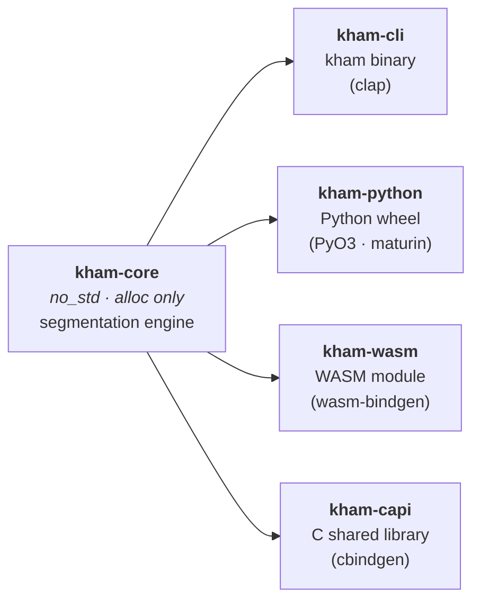
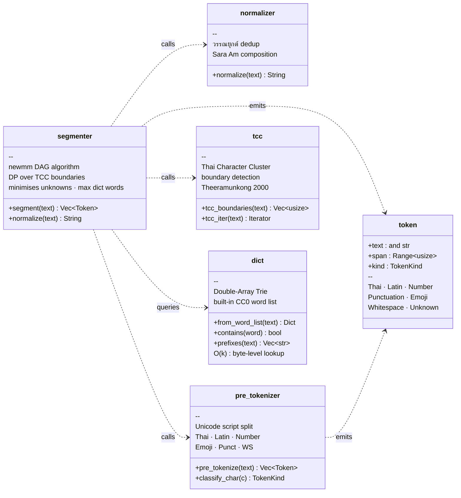
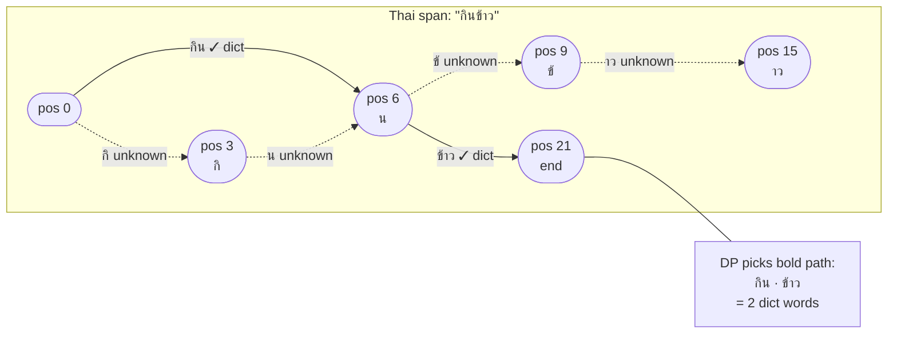
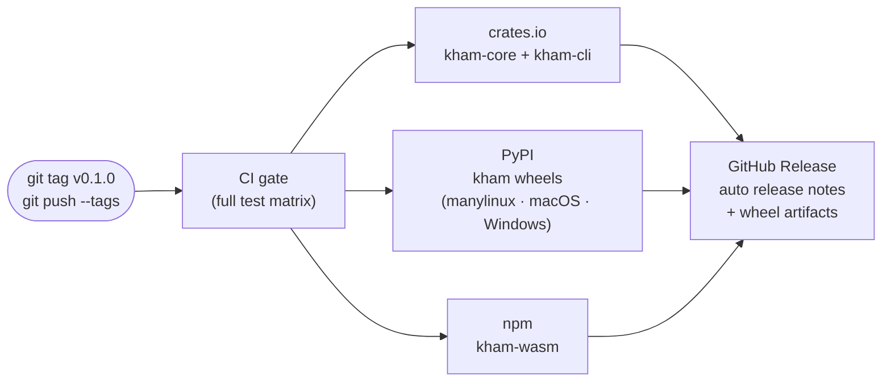

# kham

Thai word segmentation engine written in Rust. Fast, `no_std`-compatible core library with bindings for Python, WebAssembly, C, and a command-line interface.

[](https://github.com/preedep/kham/actions/workflows/ci.yml)
[](https://crates.io/crates/kham-core)
[](https://pypi.org/project/kham/)
[](https://www.npmjs.com/package/kham-wasm)

## Features

- **newmm algorithm** — DAG-based maximal matching constrained to Thai Character Cluster (TCC) boundaries
- **Multi-target** — single core library ships as a Rust crate, Python wheel, WASM module, C shared library, and CLI binary
- **Zero-copy API** — `segment()` returns `&str` slices into the original input; no heap allocation per token
- **`no_std` core** — `kham-core` compiles for bare-metal targets (`alloc` only, no `std` dependency)
- **Built-in dictionary** — 62,102-word CC0-licensed Thai word list embedded at compile time; custom dictionaries loaded at runtime
- **Text normalization** — วรรณยุกต์ dedup and Sara Am composition before segmentation

## Packages

| Crate | Registry | Description |
|---|---|---|
| `kham-core` | [crates.io](https://crates.io/crates/kham-core) | Pure Rust engine, `no_std` compatible |
| `kham-cli` | [crates.io](https://crates.io/crates/kham-cli) | `kham` binary (clap) |
| `kham-python` | [PyPI](https://pypi.org/project/kham/) | Python bindings via PyO3 / maturin |
| `kham-wasm` | [npm](https://www.npmjs.com/package/kham-wasm) | WebAssembly bindings via wasm-bindgen |
| `kham-capi` | — | C FFI with cbindgen-generated header |

## Quick start

### Rust

```toml
[dependencies]
kham-core = "0.1"
```

```rust
use kham_core::Tokenizer;

let tok = Tokenizer::new();
let tokens = tok.segment("กินข้าวกับปลา");
for t in &tokens {
    println!("{} ({:?})", t.text, t.kind);
}
// กิน (Thai)
// ข้าว (Thai)
// ...
```

Mixed script works out of the box:

```rust
let tokens = tok.segment("ธนาคาร100แห่ง");
assert_eq!(tokens[0].text, "ธนาคาร"); // Thai
assert_eq!(tokens[1].text, "100");     // Number
assert_eq!(tokens[2].text, "แห่ง");   // Thai
```

For input that may contain stacked tone marks or decomposed Sara Am, normalize first:

```rust
let normalized = tok.normalize(raw_input); // tone dedup + Sara Am composition
let tokens = tok.segment(&normalized);     // tokens borrow `normalized`
```

### Python

```bash
pip install kham
```

```python
import kham

tokens = kham.segment("กินข้าวกับปลา")
print(tokens)  # ['กิน', 'ข้าว', 'กับ', 'ปลา']
```

### JavaScript / TypeScript (WASM)

```bash
npm install kham-wasm
```

```js
import init, { segment } from "kham-wasm";
await init();

const tokens = segment("กินข้าวกับปลา");
console.log(tokens); // ["กิน", "ข้าว", "กับ", "ปลา"]
```

### CLI

```bash
cargo install kham-cli
```

```bash
# Positional argument
kham "กินข้าวกับปลา"
# กิน|ข้าว|กับ|ปลา

# Custom separator
kham --sep " / " "สวัสดีชาวโลก"
# สวัสดี / ชาว / โลก

# Show token kinds
kham --kind "ธนาคาร100แห่ง"
# ธนาคาร:Thai|100:Number|แห่ง:Thai

# Normalize before segmenting
kham --normalize "กิน\u{0E02}\u{0E49}\u{0E49}าว"

# Custom dictionary
kham --dict my_words.txt "มะม่วงหิมพานต์"

# Pipeline / stdin
echo "กินข้าว" | kham
cat corpus.txt | kham --sep " "
```

Full options:

```
Usage: kham [OPTIONS] [TEXT]

Arguments:
  [TEXT]  Thai text to segment. Reads from stdin line-by-line if omitted.

Options:
  -d, --dict <FILE>   Path to a custom word-list file (newline-separated)
  -s, --sep <SEP>     Output separator between tokens [default: |]
  -w, --whitespace    Include whitespace tokens in output
  -n, --normalize     Run normalize() before segmenting
  -k, --kind          Append token kind after each token (e.g. กิน:Thai)
  -h, --help          Print help
  -V, --version       Print version
```

## Token contract

Every `segment()` call returns `Vec<Token>`:

```rust
pub struct Token<'a> {
    pub text: &'a str,       // zero-copy slice of the input string
    pub span: Range<usize>,  // byte offsets in the original string
    pub kind: TokenKind,     // Thai | Latin | Number | Punctuation | Emoji | Whitespace | Unknown
}
```

Byte spans are always valid UTF-8 boundaries. Joining all `token.text` values (with whitespace kept) reconstructs the original input exactly.

## Custom dictionary

```rust
// From a string
let tok = Tokenizer::builder()
    .dict_words("มะม่วงหิมพานต์\nกระทะ\n")
    .build();

// From a file (requires the `std` feature)
let tok = Tokenizer::builder()
    .dict_file("my_words.txt")?
    .build();

// Keep whitespace tokens
let tok = Tokenizer::builder()
    .keep_whitespace(true)
    .build();
```

## Architecture

### Workspace crate graph



### Core module responsibilities



### Segmentation pipeline


### DAG segmentation detail



## Building

```bash
cargo build                                  # all default members
cargo test --release                         # run all tests (release recommended — dict build is ~8 s vs ~44 s debug)
cargo test -p kham-core --release            # core only
cargo bench -p kham-core                     # criterion benchmarks
cargo run -p kham-cli -- "ข้อความ"           # run CLI
```

Binding targets require additional tooling:

```bash
wasm-pack build kham-wasm --target web           # WASM
maturin develop -m kham-python/Cargo.toml        # Python wheel
```

## CI / CD

Two GitHub Actions workflows run automatically:

### CI (`ci.yml`) — every push and pull request to `main` / `develop`

| Job | What it checks |
|---|---|
| `fmt` | `cargo fmt --check` |
| `clippy` | `cargo clippy -D warnings` |
| `test` | Unit + integration + doc tests on stable and MSRV 1.78, Linux and macOS |
| `no_std` | `kham-core` compiles for `thumbv7em-none-eabihf` (bare metal) |
| `wasm` | `wasm-pack build --target web` succeeds |
| `python` | `maturin develop` on Python 3.8 and 3.12 |
| `bench_compile` | Benchmark suite compiles without errors |

### Release (`release.yml`) — on `v*.*.*` tag push

Publishes to all registries after the CI gate passes:



#### Required secrets

| Secret | Used for |
|---|---|
| `CARGO_REGISTRY_TOKEN` | crates.io publish |
| `NPM_TOKEN` | npm publish |
| PyPI — no secret needed | OIDC trusted publishing; configure via pypi.org Trusted Publisher |

To cut a release:

```bash
git tag v0.1.0
git push origin v0.1.0
```

## Benchmarks

Measured on Apple M-series (release build, LTO, built-in 62k-word dictionary):

| Benchmark | Time | Throughput |
|---|---|---|
| `segment` — short (~37 B) | ~1.0 µs | ~37 MiB/s |
| `segment` — medium (~182 B) | ~4.0 µs | ~42 MiB/s |
| `segment` — long (~546 B) | ~11.6 µs | ~44 MiB/s |
| `dict::contains` (hit) | ~13–32 ns | ~520–690 MiB/s |
| `dict::contains` (miss) | ~1.3 ns | ~4 GiB/s |
| `dict::prefixes` | ~65–112 ns | ~275–860 MiB/s |
| Dict construction (built-in, 62k words) | ~1.8 s | ~33k words/s |
| Dict construction (small custom list) | ~7 µs | — |

> Dict construction is a one-time startup cost. The built-in dictionary is embedded at compile
> time via `include_bytes!`; future versions may pre-build the trie at compile time to eliminate
> this cost.

Run locally:

```bash
cargo bench -p kham-core
# HTML report: target/criterion/report/index.html
```

## Dictionary

The built-in word list (`kham-core/data/words_th.txt`) is CC0-licensed and contains 62,102 Thai words. Custom dictionaries are newline-separated plain text files; lines beginning with `#` are treated as comments.

**Constraint:** Never ship BEST corpus data or any non-CC0 material in this repository.

## License

Licensed under either of:

- [MIT License](LICENSE-MIT)
- [Apache License, Version 2.0](LICENSE)

at your option.
