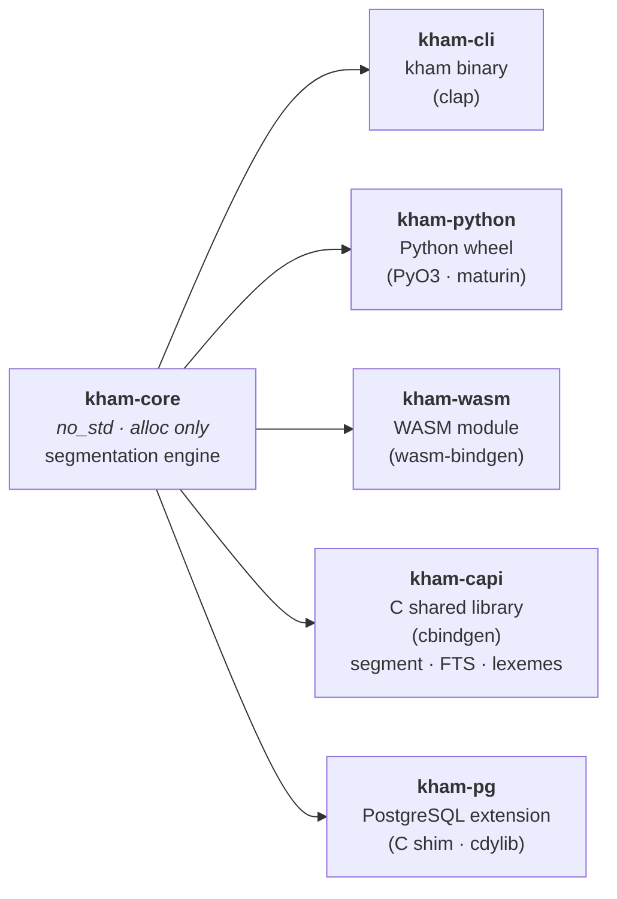
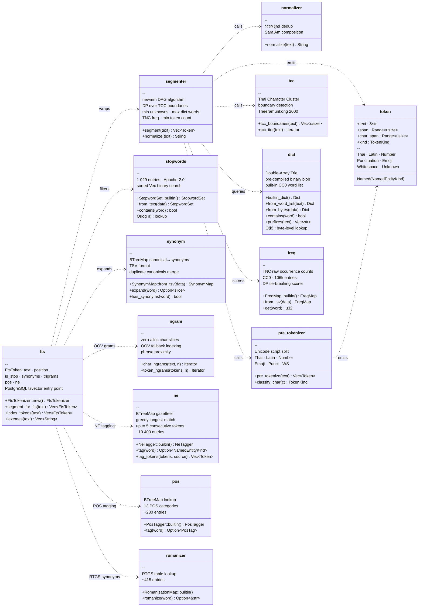
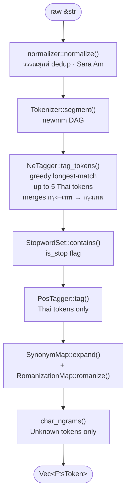
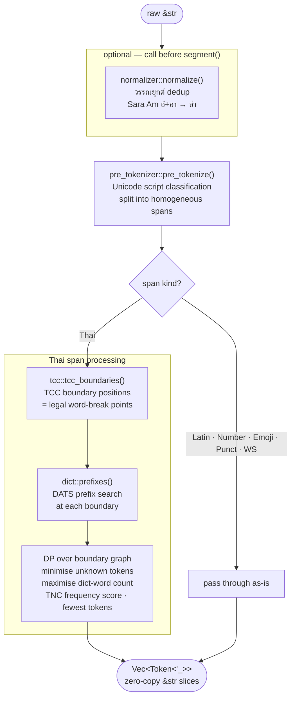
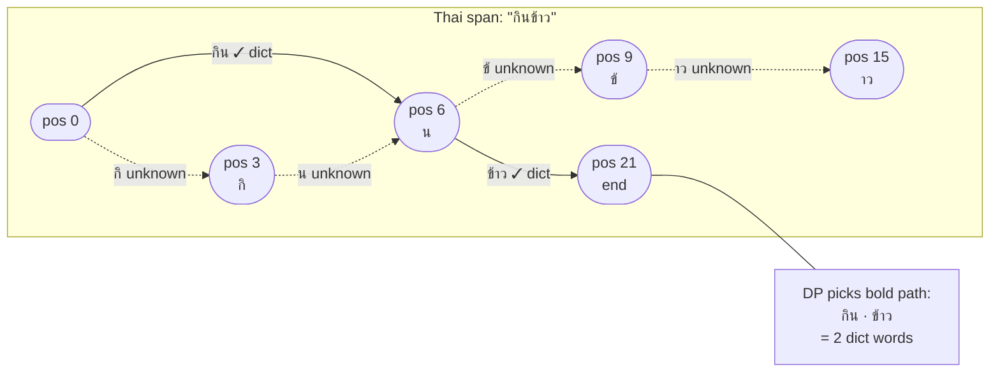
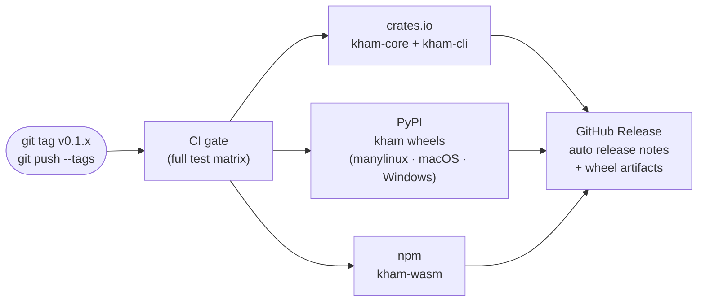

# Architecture

## Workspace crate graph

```mermaid
graph LR
    core["<b>kham-core</b><br/><i>no_std · alloc only</i><br/>segmentation engine"]

    cli["<b>kham-cli</b><br/>kham binary<br/>(clap)"]
    python["<b>kham-python</b><br/>Python wheel<br/>(PyO3 · maturin)"]
    wasm["<b>kham-wasm</b><br/>WASM module<br/>(wasm-bindgen)"]
    capi["<b>kham-capi</b><br/>C shared library<br/>(cbindgen)<br/>segment · FTS · lexemes"]
    pg["<b>kham-pg</b><br/>PostgreSQL extension<br/>(C shim · cdylib)"]

    core --> cli
    core --> python
    core --> wasm
    core --> capi
    core --> pg
```

## Core module responsibilities

```mermaid
classDiagram
    direction LR

    class normalizer {
        +normalize(text) String
        --
        วรรณยุกต์ dedup
        Sara Am composition
    }

    class pre_tokenizer {
        +pre_tokenize(text) Vec~Token~
        +classify_char(c) TokenKind
        --
        Unicode script split
        Thai · Latin · Number
        Emoji · Punct · WS
    }

    class tcc {
        +tcc_boundaries(text) Vec~usize~
        +tcc_iter(text) Iterator
        --
        Thai Character Cluster
        boundary detection
        Theeramunkong 2000
    }

    class dict {
        +builtin_dict() Dict
        +from_word_list(text) Dict
        +from_bytes(data) Dict
        +contains(word) bool
        +prefixes(text) Vec~str~
        --
        Double-Array Trie
        O(k) byte-level lookup
        pre-compiled binary blob
        built-in CC0 word list
    }

    class freq {
        +FreqMap::builtin() FreqMap
        +from_tsv(data) FreqMap
        +get(word) u32
        --
        TNC raw occurrence counts
        CC0 · 106k entries
        DP tie-breaking scorer
    }

    class segmenter {
        +segment(text) Vec~Token~
        +normalize(text) String
        --
        newmm DAG algorithm
        DP over TCC boundaries
        min unknowns · max dict words
        TNC freq · min token count
    }

    class token {
        +text : &str
        +span : Range~usize~
        +char_span : Range~usize~
        +kind : TokenKind
        --
        Thai · Latin · Number
        Punctuation · Emoji
        Whitespace · Unknown
        Named(NamedEntityKind)
    }

    class stopwords {
        +StopwordSet::builtin() StopwordSet
        +from_text(data) StopwordSet
        +contains(word) bool
        --
        1 029 entries · Apache-2.0
        sorted Vec binary search
        O(log n) lookup
    }

    class synonym {
        +SynonymMap::from_tsv(data) SynonymMap
        +expand(word) Option~slice~
        +has_synonyms(word) bool
        --
        BTreeMap canonical→synonyms
        TSV format
        duplicate canonicals merge
    }

    class ngram {
        +char_ngrams(text, n) Iterator
        +token_ngrams(tokens, n) Iterator
        --
        zero-alloc char slices
        OOV fallback indexing
        phrase proximity
    }

    class ne {
        +NeTagger::builtin() NeTagger
        +tag(word) Option~NamedEntityKind~
        +tag_tokens(tokens, source) Vec~Token~
        --
        BTreeMap gazetteer
        greedy longest-match
        up to 5 consecutive tokens
        ~10 400 entries
    }

    class pos {
        +PosTagger::builtin() PosTagger
        +tag(word) Option~PosTag~
        --
        BTreeMap lookup
        13 POS categories
        ~230 entries
    }

    class romanizer {
        +RomanizationMap::builtin()
        +romanize(word) Option~&str~
        --
        RTGS table lookup
        ~415 entries
    }

    class fts {
        +FtsTokenizer::new() FtsTokenizer
        +segment_for_fts(text) Vec~FtsToken~
        +index_tokens(text) Vec~FtsToken~
        +lexemes(text) Vec~String~
        --
        FtsToken: text · position
        is_stop · synonyms · trigrams
        pos · ne
        PostgreSQL tsvector entry point
    }

    segmenter ..> normalizer : calls
    segmenter ..> pre_tokenizer : calls
    segmenter ..> tcc : calls
    segmenter ..> dict : queries
    segmenter ..> freq : scores
    segmenter ..> token : emits
    pre_tokenizer ..> token : emits
    fts ..> segmenter : wraps
    fts ..> ne : NE tagging
    fts ..> pos : POS tagging
    fts ..> stopwords : filters
    fts ..> synonym : expands
    fts ..> ngram : OOV grams
    fts ..> romanizer : RTGS synonyms
```

## FTS pipeline (segment_for_fts)

```mermaid
flowchart TD
    INPUT(["raw &str"])
    NORM["normalizer::normalize()\nวรรณยุกต์ dedup · Sara Am"]
    SEG["Tokenizer::segment()\nnewmm DAG"]
    NE["NeTagger::tag_tokens()\ngreedy longest-match\nup to 5 Thai tokens\nmerges กรุง+เทพ → กรุงเทพ"]
    STOP["StopwordSet::contains()\nis_stop flag"]
    POS["PosTagger::tag()\nThai tokens only"]
    SYN["SynonymMap::expand()\n+ RomanizationMap::romanize()"]
    NGRAM["char_ngrams()\nUnknown tokens only"]
    OUT(["Vec&lt;FtsToken&gt;"])

    INPUT --> NORM --> SEG --> NE --> STOP --> POS --> SYN --> NGRAM --> OUT
```

## Segmentation pipeline

```mermaid
flowchart TD
    INPUT(["raw &str"])

    subgraph OPTIONAL["optional — call before segment()"]
        NORM["normalizer::normalize()\nวรรณยุกต์ dedup\nSara Am อํ+อา → อำ"]
    end

    PRE["pre_tokenizer::pre_tokenize()\nUnicode script classification\nsplit into homogeneous spans"]
    SPLIT{span kind?}
    PASS["pass through as-is"]

    subgraph THAI_PATH["Thai span processing"]
        TCC["tcc::tcc_boundaries()\nTCC boundary positions\n= legal word-break points"]
        DICT["dict::prefixes()\nDATS prefix search\nat each boundary"]
        DAG["DP over boundary graph\nminimise unknown tokens\nmaximise dict-word count\nTNC frequency score · fewest tokens"]
    end

    MERGE(["Vec&lt;Token&lt;'_&gt;&gt;\nzero-copy &str slices"])

    INPUT --> OPTIONAL --> PRE --> SPLIT
    SPLIT -->|"Thai"| TCC --> DICT --> DAG --> MERGE
    SPLIT -->|"Latin · Number · Emoji · Punct · WS"| PASS --> MERGE
```

## DAG segmentation detail

```mermaid
flowchart LR
    subgraph INPUT["Thai span: &quot;กินข้าว&quot;"]
        direction LR
        C0(["pos 0"])
        C1(["pos 3\n กิ"])
        C2(["pos 6\n น"])
        C3(["pos 9\n ข้"])
        C4(["pos 15\n าว"])
        C5(["pos 21\n end"])
    end

    C0 -->|"กิน ✓ dict"| C2
    C0 -.->|"กิ  unknown"| C1
    C1 -.->|"น   unknown"| C2
    C2 -->|"ข้าว ✓ dict"| C5
    C2 -.->|"ข้  unknown"| C3
    C3 -.->|"าว  unknown"| C4

    BEST["DP picks bold path:\nกิน · ข้าว\n= 2 dict words"]
    C5 --- BEST
```

## Release pipeline

```mermaid
flowchart LR
    TAG(["git tag v0.1.x\ngit push --tags"])
    CI["CI gate\n(full test matrix)"]
    CRATES["crates.io\nkham-core + kham-cli"]
    PYPI["PyPI\nkham wheels\n(manylinux · macOS · Windows)"]
    NPM["npm\nkham-wasm"]
    GH["GitHub Release\nauto release notes\n+ wheel artifacts"]

    TAG --> CI --> CRATES & PYPI & NPM --> GH
```
