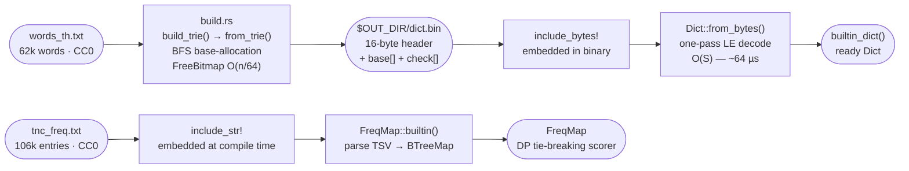

# Built-in Dictionary Format (`dict.bin`)

`build.rs` compiles the built-in word list into a binary Double-Array Trie blob (`$OUT_DIR/dict.bin`)
once at build time. At runtime, `builtin_dict()` loads this blob via `Dict::from_bytes`, which is
~15,000× faster than reconstructing the trie from the text word list (~64 µs vs ~960 ms).

## File format

All multi-byte integers are **little-endian**. The file begins with a fixed 16-byte header followed
immediately by the two DARTS arrays.

| Offset | Size (bytes) | Field | Type | Description |
|-------:|-------------:|-------|------|-------------|
| 0 | 4 | `magic` | `[u8;4]` | `b"KDAM"` — file-type identifier |
| 4 | 1 | `version` | `u8` | Format version; currently `0x01` |
| 5 | 3 | `reserved` | `[u8;3]` | Zero-filled; reserved for future flags |
| 8 | 4 | `base_len` | `u32` | Number of `i32` elements in the `base` array |
| 12 | 4 | `check_len` | `u32` | Number of `i32` elements in the `check` array |
| 16 | `base_len×4` | `base[]` | `i32[]` | DARTS base offsets, little-endian |
| `16 + base_len×4` | `check_len×4` | `check[]` | `i32[]` | DARTS parent-state indices, little-endian (`-1` = unused slot) |

## Lifecycle

## Validity guarantees

`Dict::from_bytes` panics on malformed input rather than returning an error, because failures always
indicate a stale or corrupted build artifact — not a recoverable runtime condition. A clean
`cargo build` regenerates a valid blob automatically.

| Condition checked | Panic message |
|---|---|
| `data.len() < 16` | `"dict.bin too short"` |
| Bytes 0–3 ≠ `b"KDAM"` | `"dict.bin: bad magic"` |
| Byte 4 ≠ `0x01` | `"dict.bin: unsupported version"` |

## Data sources

| File | License | Entries | Purpose |
|---|---|---|---|
| `data/words_th.txt` | CC0 | 62,102 words | Built-in segmentation dictionary |
| `data/tnc_freq.txt` | CC0 | 106,125 entries | TNC raw counts → DP tie-breaking scorer |
| `data/stopwords_th.txt` | Apache-2.0 (PyThaiNLP) | 1,029 words | FTS stopword filter |
| `data/ne_th.tsv` | Apache-2.0 (PyThaiNLP) + hand-curated | ~10,400 entries | NE gazetteer (Person/Place/Org) |
| `data/pos_th.tsv` | hand-curated | ~230 entries | POS lookup table |
| `data/romanization_th.tsv` | hand-curated | ~415 entries | RTGS romanization table |

**Constraint:** Never ship BEST corpus data or any non-Apache-2.0/CC0 material in this repository.

The frequency table is embedded at compile time and loaded into a `FreqMap` at runtime. It is kept
separate from `dict.bin` — do not merge them.

The stopword list is sourced from [PyThaiNLP](https://github.com/PyThaiNLP/pythainlp) (Apache-2.0)
and embedded via `include_str!`. Attribution is preserved in the header of `stopwords_th.txt`.

The NE gazetteer (`ne_th.tsv`) combines hand-curated entries with filtered imports from PyThaiNLP
corpora (Apache-2.0). Person names are filtered to exclude words that appear in `words_th.txt` to
limit false positives — see [ADR-001](adr-001-ne-person-name-import-strategy.md).
